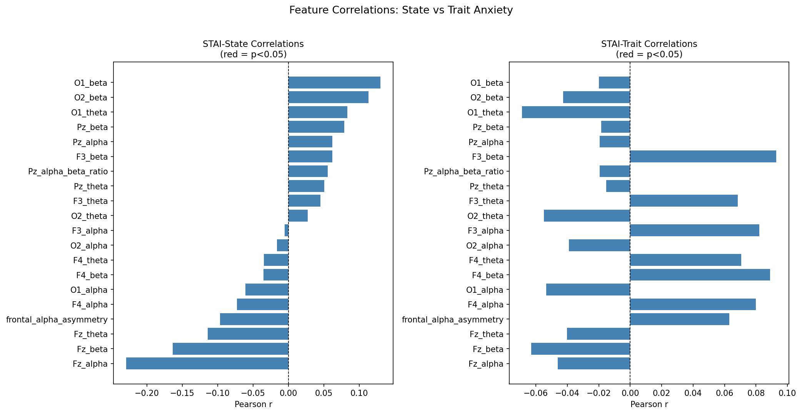

# EEG-Based Anxiety Classification

A system for classifying anxiety from resting-state EEG using spectral band power features. Built as part of a neuroscience-to-ML portfolio targeting health AI and BCI operations.

---

## Overview

This project investigates whether resting-state EEG spectral features can distinguish anxiety states and traits in a 51-subject dataset. Three classification tasks were evaluated — eyes open vs. eyes closed (EO/EC), state anxiety, and trait anxiety — using logistic regression, random forest, and SVM across both epoch-level and subject-level cross-validation schemes.

The central finding is that **temporal alignment predicts classification performance more than model complexity**. EO/EC classification (where the neural label and behavioral state are simultaneous) achieves 67% accuracy, while trait anxiety (a stable disposition measured days or weeks before recording) falls below chance because the signal-label relationship is fundamentally weaker.

---

## Dataset

**Source:** [OpenNeuro ds007609](https://openneuro.org/datasets/ds007609/versions/1.0.0) — Resting State EEG and Trait Anxiety  
**Subjects:** 51  
**Labels:** STAI state and trait anxiety scores, eyes open/closed condition  
**EEG:** Preprocessed derivatives used (ICA-cleaned, average-referenced, bandpass filtered 0.1–50 Hz)

To reproduce, download the dataset from OpenNeuro and place the `derivatives/preprocessed/` folder in a local `data/` directory before running.

---

## System

The pipeline is modular across five files, orchestrated by `main.py`:

| File | Role |
|---|---|
| `config.py` | Paths, channel mappings, band definitions |
| `preprocess.py` | Epoch extraction, EGI-to-10-20 channel mapping |
| `features.py` | Welch PSD, band power extraction, derived features |
| `build_dataset.py` | Assembles feature matrix with STAI labels |
| `classify.py` | Cross-validation, model training, evaluation |

**Features extracted:**
- Log-scale band power: theta (4–8 Hz), alpha (8–13 Hz), beta (13–30 Hz)
- Channels: F3, F4, Fz, O1, O2, Pz (EGI-to-10-20 geometrically verified)
- Derived: frontal alpha asymmetry (F4−F3 alpha), Pz alpha/beta ratio

**Cross-validation:**
- Epoch-level: StratifiedGroupKFold (subject as group, prevents leakage)
- Subject-level: LeaveOneGroupOut

---

## Results

| Task | Best Model | Accuracy | F1 |
|---|---|---|---|
| EO vs EC | SVM | 0.673 | 0.669 |
| State Anxiety (epoch-level) | Logistic Regression | 0.502 | 0.491 |
| State Anxiety (subject-level) | LR / RF | 0.549 | 0.549 |
| Trait Anxiety (epoch-level) | Logistic Regression | 0.419 | 0.387 |

**Key findings:**
- EO/EC classification is driven by occipital alpha suppression (O2_alpha, O1_alpha rank highest in feature importance) — consistent with the well-established alpha blocking response
- State anxiety shows modest above-chance classification at the subject level (54.9%), with Fz_alpha as the strongest individual correlate (r = −0.229)
- Trait anxiety falls below chance across all models and CV schemes, with feature correlations reversing direction relative to state anxiety — frontal beta dominates trait correlations while frontal alpha dominates state
- The divergence in state vs. trait performance reflects a temporal alignment problem, not a modeling failure

---

## Installation

```bash
git clone https://github.com/joshthrelkeld/eeg_anxiety.git
cd eeg_anxiety
pip install -r requirements.txt
```

## Usage

```bash
# Run full pipeline (uses cached features if available)
python main.py

# Re-extract features from raw EEG files
python main.py --rebuild
```

---

## Selected Figures

**Feature Correlations: State vs Trait Anxiety**  


**Confusion Matrices — EO vs EC**  


**Confusion Matrices — State Anxiety**  


---

## Background

Built by Josh Threlkeld, University of Southern California Neuroscience '25, as part of a neuroscience and machine learning portfolio. The goal is to understand what resting-state EEG can and cannot tell us about anxiety, rather than chasing benchmark accuracy.
